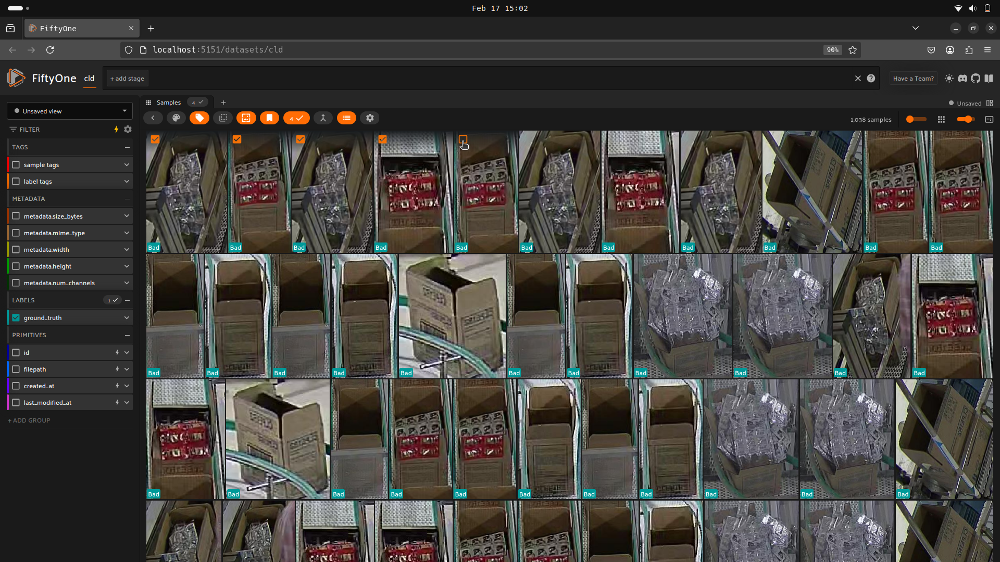
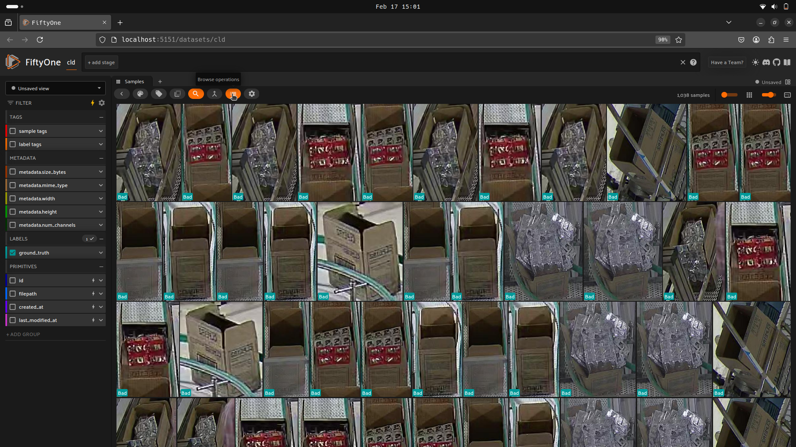
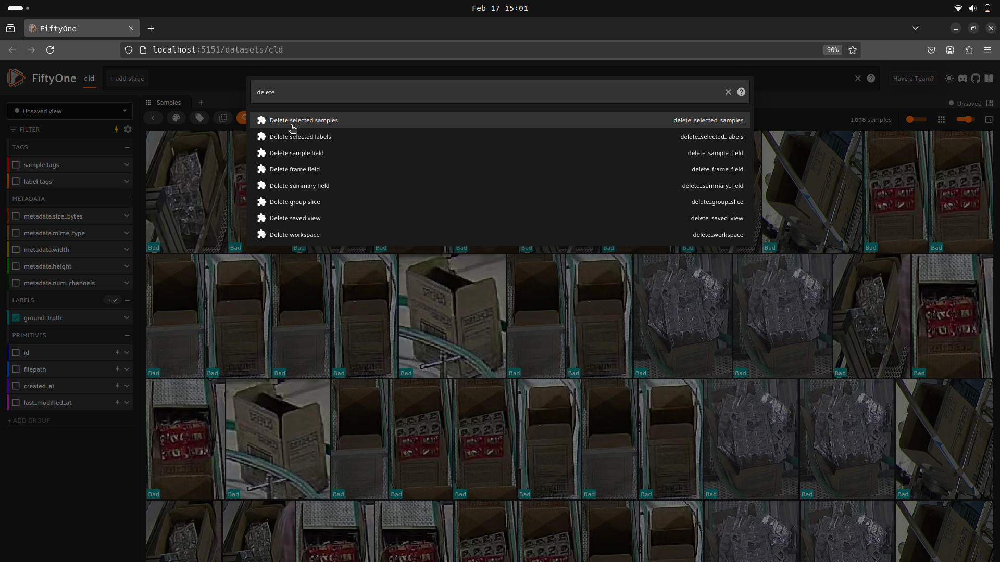
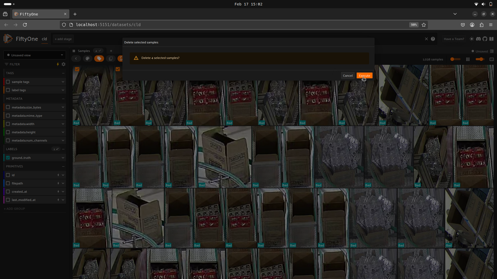
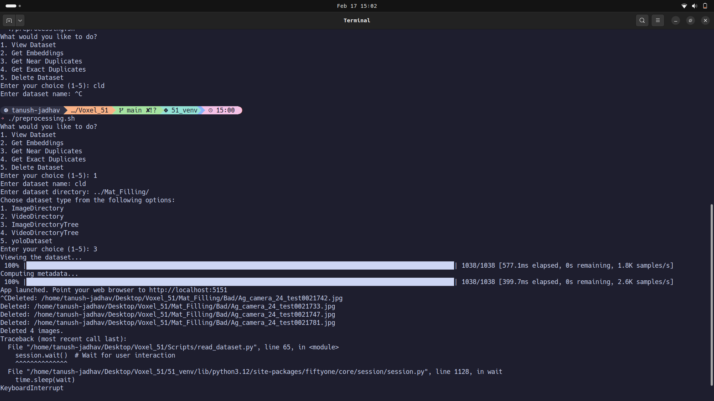

# FiftyOne Setup & Usage Guide

## Setup Instructions

Follow these steps to run FiftyOne using Podman on the Workstation.

### 1. Create or Attach to a Tmux Session
If you don't have a Tmux session running, create a new one or attach to an existing session:
```bash
 tmux new-session -t <session-name>
```

### 2. Start FiftyOne in a Podman/Docker Container
Run the following command to start FiftyOne inside the fiftyone container:
```bash
podman run -it --rm --net=host --ipc=host -v /home/ai4m/:/home/ai4m docker.io/voxel51/fiftyone:latest /bin/bash
```

### 3. Navigate to the FiftyOne Folder
Move to the directory where FiftyOne files are stored:
```bash
cd /home/ai4m/fiftyone/
```

### 4. Run Required Scripts
Depending on your task, execute the appropriate script:

#### Pre-Processing
```bash
./preprocessing.sh
```

#### CVAT Integration
```bash
./cvat.sh
```
### 4. Open FiftyOne on Your System
To access FiftyOne, copy and paste the following link into your browser:

```bash
http://100.64.84.30:5151
```

---

## Available Actions

### 1. **View Dataset**
Loads a dataset into FiftyOne for visualization and inspection.

### 2. **Generate Embeddings**
Extracts feature embeddings from a model to visualize dataset characteristics. You can also check the uniqueness and representativeness of images in the dataset.

### 3. **Find Near Duplicates**
Identifies visually similar images based on a set similarity threshold.

### 4. **Detect Exact Duplicates**
Locates and displays completely identical images within the dataset.

### 5. **Delete Dataset**
Removes a dataset from FiftyOne's memory.
<br>
Use this if you encounter the following error:
```bash
ValueError: Dataset name <name> is not available
```

---

## How to Delete Images from Dataset in FiftyOne
Steps to delete images from your dataset/folder on disk. This can be used with all the available actions mentioned above.

### Step 1: Select Images to Delete
Click the orange box on the top right of the image you want to delete.



### Step 2: Open the Browse Operations Menu
Click the 'Browse Operations' button as shown in the image below.



### Step 3: Search for 'Delete Selected Samples'
In the search bar that appears, type 'Delete Selected Samples' and select it.



### Step 4: Execute the Deletion
Click 'Execute' to delete the selected images.



### Step 5: Terminate the Session
Open the terminal where you ran the script and press `CTRL + C` to kill the session. The images will be automatically deleted from your dataset/folder.



